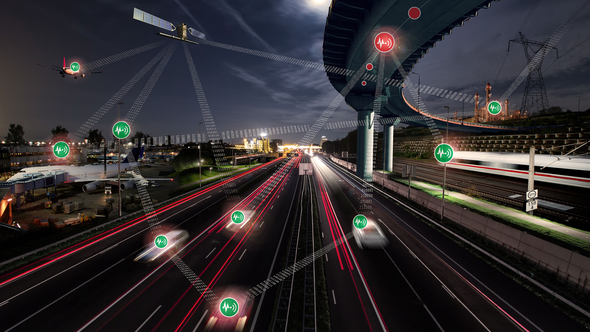

**View of a highway between an airport and an ICE line** \
Credit: [DLR (CC BY-NC-ND 3.0)](https://www.dlr.de/en/service/imprint)

Welcome to the DLR-PI Github. We create holistic tools, processes, and tech to boost the resilience of critical organizations. Key projects include intelligent sensors for infrastructure monitoring and hazardous substance detection (especially CBRNE threats). Central to our approach is the digital twin: An accurate digital replica that uses real‑time data to analyze and predict system behavior in crises.

    <h2>
        Contact
    </h2>
    

        

            

                <h3 class="name">Prof. Dr. Tina Comes</h3>
                
Co-Head of Institute

                
German Aerospace Center (DLR)

                
Institute for the Protection of Terrestrial Infrastructures

                
Rathausallee 12, 53757 Sankt Augustin

                
Germany

            

        

        

            

                <h3 class="name"> Michael Langerbeins</h3>
                
Acting head of institute

                
Ger­man Aerospace Cen­ter (DLR)

                
Institute for the Protection of Terrestrial Infrastructures

                
Rathausallee 12, 53757 Sankt Augustin

                
Germany

            

        

    

## Links
[Website](https://www.dlr.de/en/pi)

    

